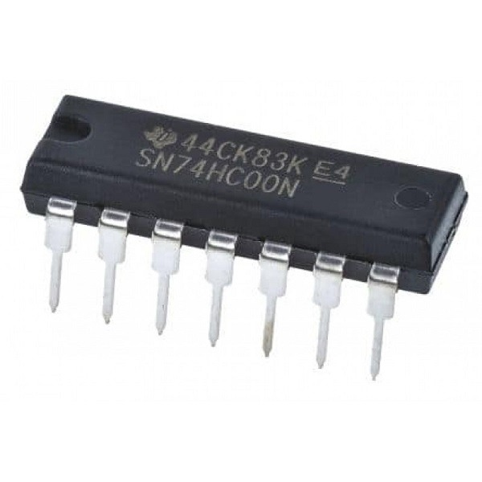
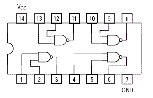
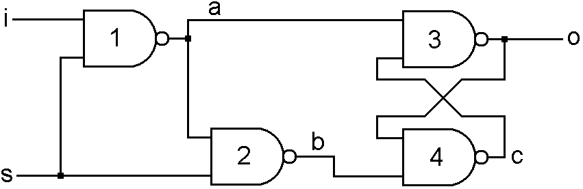
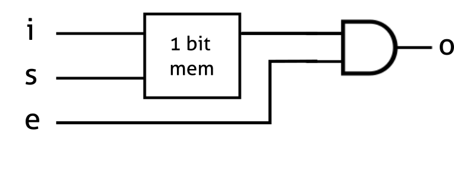
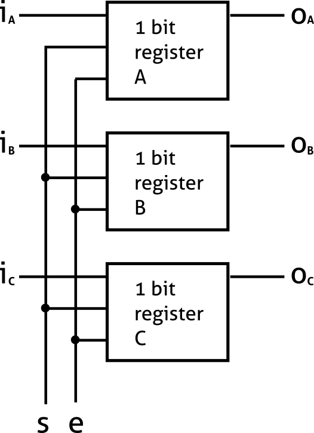

# Practicum EOS

Benodigdheden
 - Raspberry Pi
 - Breadboard
 - Draadjes / Ledjes / Knopjes

## Deel 1

Jullie krijgen van ons per persoon 2 NAND-chips, elke NAND-chip bevat 4
NAND-gates, zo'n chip ziet er als volgt uit:

4 NAND-gate chip

Schema

Zoals je ziet heeft deze chip een Vcc pin en een GND pin, deze worden
gebruikt om de chip van voeding te voorzien. De Vcc pin kan je
aansluiten op de 3.3 Volt pin van je Raspberry Pi en de GND pin op de
Ground pin. De overige pinnen worden gebruikt voor 4 nand gates. In
totaal heb je dus 8 NAND-gates tot je beschikking. Deze ga je gebruiken
om twee onderdelen uit de slides te bouwen, een 1-bit register (latch)
en een enabler. De enabler gebruik je om de output van een het register
op een eventuele bus te zetten. Hoe een enabler en een register precies
werken is terug te vinden in de slides. Uiteindelijk heeft je breadboard
dus 3 inputs en een output. De inputs zijn de Set, Data en Enable input.
De Set en Data bepalen de staat van het register, als Set wordt aangezet
neemt het register de waarde van de Data pin over. Als vervolgens de
Enable wordt aangezet wordt de output ook gelijk aan de waarde van het
register. Om de werking van je register te testen gebruik je knopjes als
input en laat je de staat van het register en de output met een LEDje
zien.

## Deel 2

### Stap 1 (begin met 3 en 4)

Maak de flip-flop met 4 NANDjes. Gebruik knopjes om deze te testen. **Vergeet hierbij geen pull down weerstanden toe te voegen *(zie Hints)***

### Stap 2

Maak van je flip-flop een echte geheugencel door een enabler toe te voegen. *De AND (of eigenlijk NNAND) kun je maken met een NAND en een NOT; een
NOT kan je maken met een NAND.*

### Stap 3

Nu iedereen in je groepje een eigen 1 bit register heeft gemaakt zullen
jullie je registers combineren tot een {len(groep)}-bits register.
Alle inputs worden aangesloten op een IO pin van de Raspberry Pi / Arduino. De
losse set en enable inputs van de registers worden gecombineerd en ook
aangesloten op twee pinnen IO pinnen. Eventueel kun je code schrijven om de
pinnen aan te sturen en de werking van je register te demonstreren, maar dit
kan ook met knopjes. Het zou voor de demo mooi zijn als je alle ledjes van de
losse registers op een breadboard weet onder te brengen.

## Hints

Voor het gebruiken van de knopjes is een zogenaamde pull down weerstand
nodig. Deze zorgt ervoor dat als de knop *niet* wordt ingedrukt, de
waarde die naar de chip gaat 0 is, en niet undefined. Let er ook op dat
bij het aansluiten van knoppen je vier pinnen hebt. De paren van pinnen
tegenover elkaar zijn in de buttons aan elkaar verbonden, dus de twee
pinnen die je daadwerkelijk gebruikt moeten naast of schuin tegenover
elkaar zitten.

Als stroombron kun je de 3V3 of 5V en GND van de Raspberry Pi  gebruiken:

Alternatief kun je dit aansluiten op een Arduino of andere 5V stroombron.
